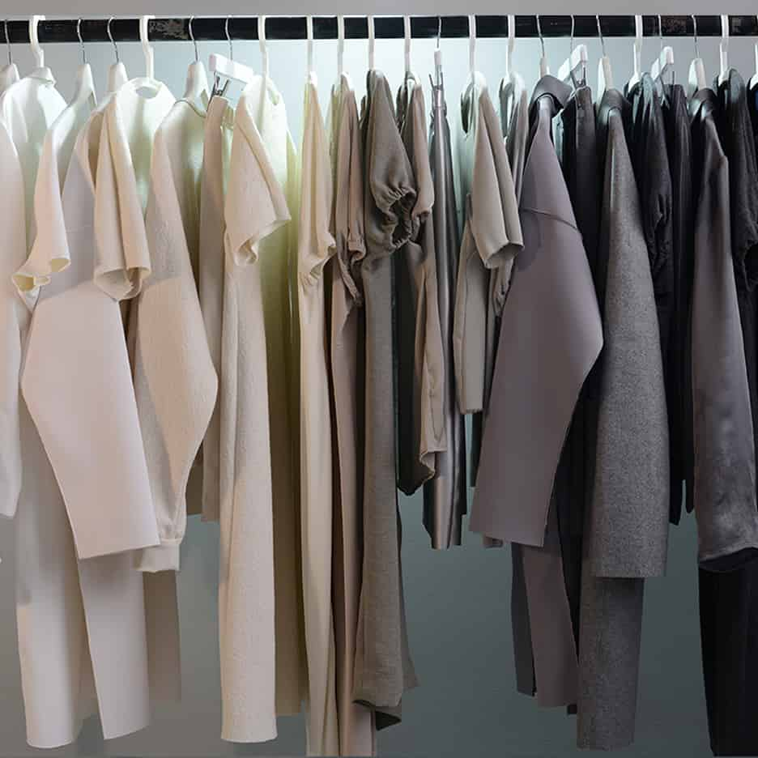
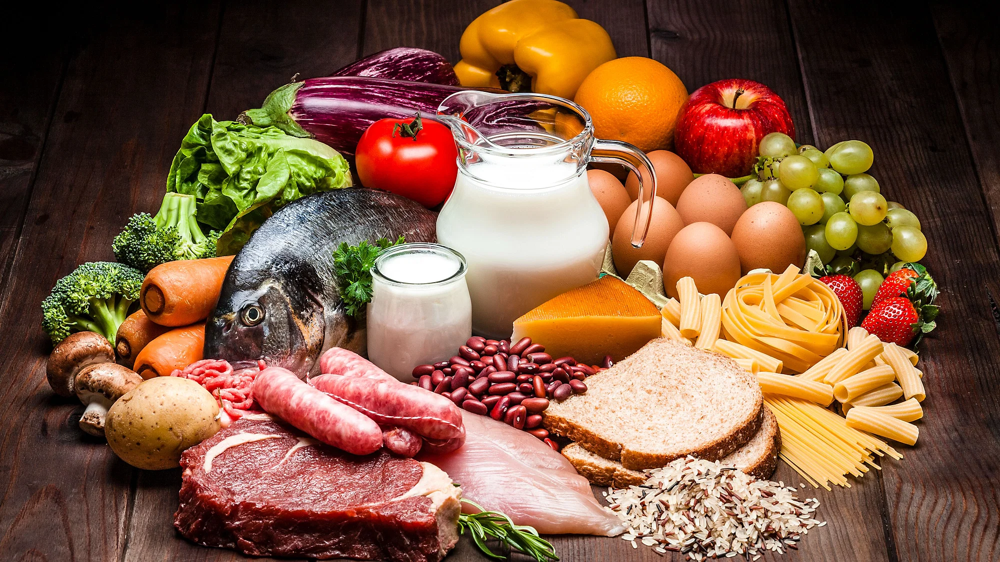

# healthcare

<!DOCTYPE html>
<html lang="en">
<head>
    <meta charset="UTF-8">
    <meta name="viewport" content="width=device-width, initial-scale=1.0">
    <title>Healthy Living for Women Over 65</title>
    <link rel="stylesheet" href="style.css">
</head>
<body>
    <header>
        <h1>Healthy Living for Women Over 65</h1>
    </header>

    <nav>
        <ul>
            <li><a href="#daily-necessities">Daily Necessities</a></li>
            <li><a href="#health-tips">Health Tips</a></li>
            <li><a href="#contact">Contact</a></li>
        </ul>
    </nav>

    <section id="daily-necessities">
        <h2>Daily Necessities</h2>
        
Here are some essential items for a healthy and comfortable life:

        <ul>
            <li>Comfortable clothing</li>
            <li>Nutritious food</li>
            <li>Medication management</li>
            <!-- Add more items as needed -->
        </ul>
        
        
        
    </section>

    <section id="health-tips">
        <h2>Health Tips</h2>
        
Follow these tips for a healthier life:

        <ul>
            <li>Stay physically active with exercises suitable for your age</li>
            <li>Eat a balanced diet rich in nutrients</li>
            <li>Stay socially connected with friends and family</li>
            <!-- Add more tips as needed -->
        </ul>
        
        
        
    </section>

    <section id="contact">
        <h2>Contact</h2>
        
If you have any questions or need assistance, feel free to reach out:

        <form>
            <label for="name">Name:</label>
            <input type="text" id="name" name="name" required>

            <label for="email">Email:</label>
            <input type="email" id="email" name="email" required>

            <label for="message">Message:</label>
            <textarea id="message" name="message" required></textarea>

            <button type="submit">Submit</button>
        </form>
        <button class="nav-toggle">Toggle Navigation</button>
        <nav>
            <button class="nav-toggle">Toggle Navigation</button>
            <ul>
                <li><a href="#daily-necessities">Daily Necessities</a></li>
                <li><a href="#health-tips">Health Tips</a></li>
                <li><a href="#contact">Contact</a></li>
            </ul>
        </nav>
        
    </section>

    <footer>
        
&copy; 2024 Healthy Living for Women Over 65. All rights reserved.

    </footer>

    
</body>
</html>

#css
body {
    font-family: 'Arial', sans-serif;
    margin: 0;
    padding: 0;
    background-color: #f4f4f4;
}

header {
    background-color: #333;
    color: #fff;
    text-align: center;
    padding: 1em;
}

nav {
    background-color: #444;
    color: #fff;
    text-align: center;
    padding: 0.5em;
}

nav ul {
    list-style: none;
    padding: 0;
    margin: 0;
}

nav ul li {
    display: inline;
    margin-right: 10px;
}

nav a {
    text-decoration: none;
    color: #fff;
    font-weight: bold;
}

.nav-toggle {
    display: none; /* Hide the navigation toggle button by default */
}

section {
    padding: 20px;
}

img {
    max-width: 10%;
    height: auto;
    margin-bottom: 15px;
    border-radius: 8px;
    box-shadow: 0 4px 8px rgba(0, 0, 0, 0.1);
}

footer {
    background-color: #333;
    color: #fff;
    text-align: center;
    padding: 1em;
    position: fixed;
    width: 100%;
    bottom: 0;
}

form {
    display: grid;
    grid-template-columns: 1fr 1fr;
    grid-gap: 20px;
}

button {
    padding: 10px;
    background-color: #444;
    color: #fff;
    border: none;
    cursor: pointer;
}

button:hover {
    background-color: #555;
}

@media screen and (max-width: 768px) {
    nav ul {
        display: none;
        flex-direction: column;
        align-items: center;
    }

    nav ul.show {
        display: flex;
    }

    .nav-toggle {
        display: block; /* Display the navigation toggle button on smaller screens */
        background-color: #444;
        color: #fff;
        border: none;
        padding: 10px;
        cursor: pointer;
    }
}
